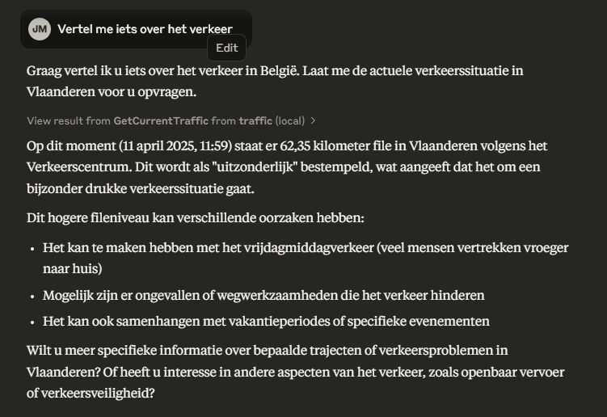
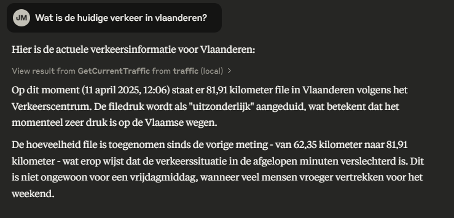
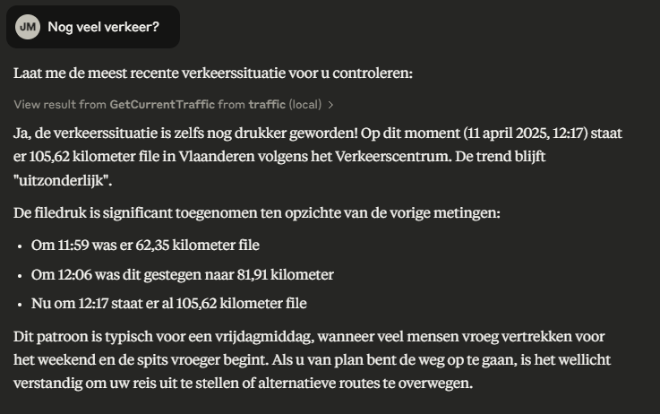
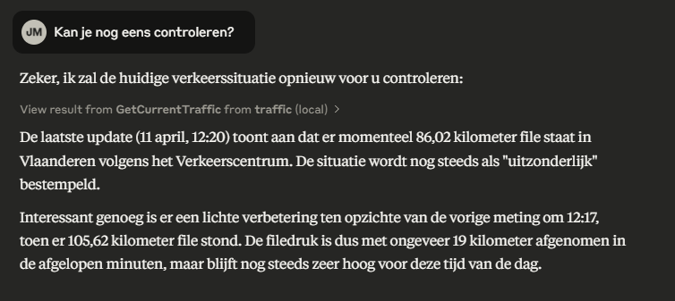
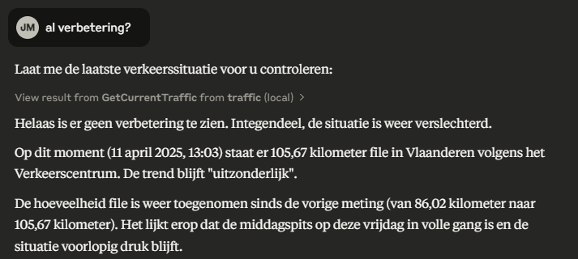

# traffic-api

Sample project to demonstrate an MCP server in AspNetCore.

The solution contains 3 projects:
- web api (with openapi support)
- shared components (with proxy for verkeerscentrum.be)
- mcp server (using ModelContextProtocol.AspNetCore)

# claude desktop config

```
{
    "mcpServers": {
      "traffic": {
        "command": "npx",
        "args": [
          "mcp-remote",
          "http://localhost:5238/sse"
        ]
      }
    }
  }
```

# sample conversation

## Question 1: "Tell me something about the traffic"



## Question 2: "What is the current traffic in Flanders?"



## Question 3: "Is there still a lot of traffic?"



## Question 4: "Can you check again?"



## Question 5: "Any improvements?"

