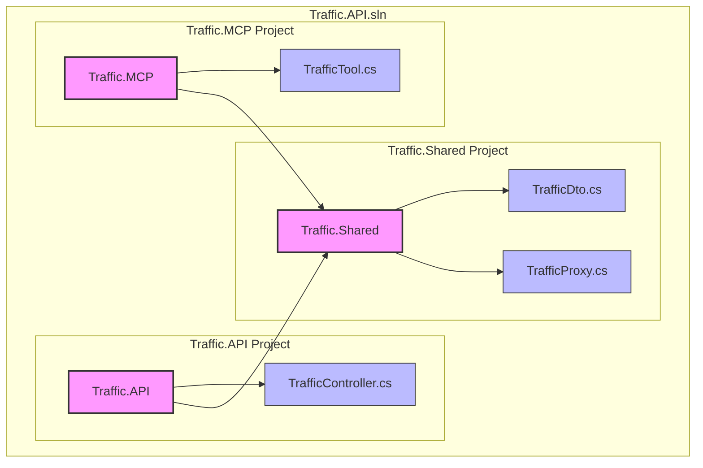

# traffic-api

Sample project to demonstrate an MCP server in AspNetCore.

The solution contains 3 projects:
- web api (with openapi support)
- shared components (with proxy for verkeerscentrum.be)
- mcp server (using ModelContextProtocol.AspNetCore)



# vscode config 

```
"mcp": 
{
    "inputs": [],
    "servers": {            
        "traffic-mcp-server": {
            "type": "sse",
            "url": "http://localhost:5238/sse"
        }
    }
},
```

# claude desktop config

```
{
    "mcpServers": {
      "traffic": {
        "command": "npx",
        "args": [
          "mcp-remote",
          "http://localhost:5238/sse"
        ]
      }
    }
  }
```

# sample conversation

## Question 1: Claude - "Tell me something about the traffic"


## Question 2: Claude - "What is the current traffic in Flanders?"


## Question 3: Claude - "Is there still a lot of traffic?"


## Question 4: Claude - "Can you check again?"


## Question 5: Claude - "Any improvements?"


## Question 6: VS Code - "What is the current traffic like?"


## Question 7: VS Code - "How is the traffic evolving?"


## Question 8: VS Code - "Check again"


